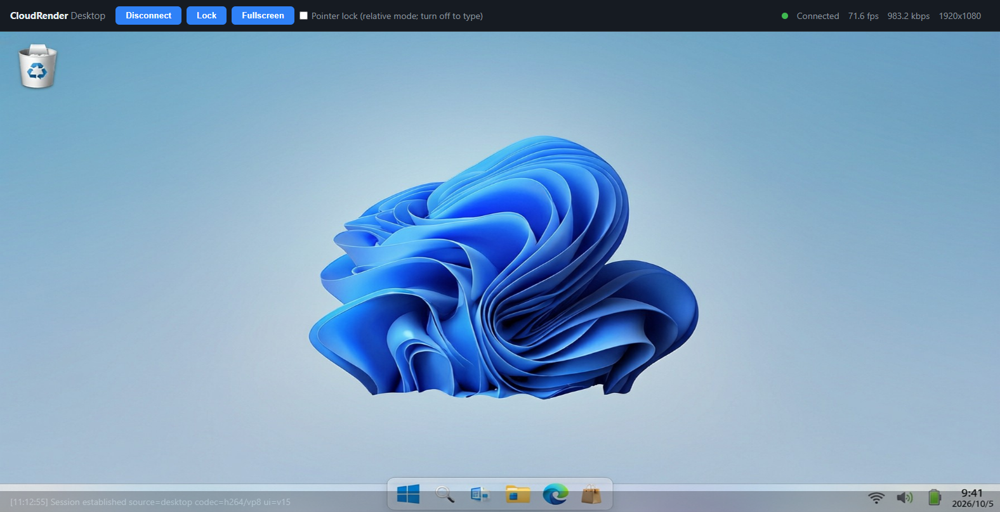

# CloudRender Desktop

**English** | [中文](#中文)

## English

A **WebRTC**-based cloud desktop: the server captures the OS desktop/window image (like a screenshot; any software works with zero modification) and streams it to a browser over WebRTC, while keyboard/mouse input is sent back to the remote — "operate locally, render in the cloud".

Beyond the out-of-the-box cloud desktop demo, the project also ships per-language SDKs (server: Python/C++, client: JavaScript) so the cloud desktop capability can be embedded into your own applications.

## Highlights

- **Universal capture**: render source = desktop/window screen capture (DXGI Desktop Duplication, zero-copy); no software needs any modification;
- **Unified protocol**: all server implementations share the same signaling and binary input protocol ([docs/protocol.md](docs/protocol.md)); zero client-side differences;
- **High-performance core**: desktop capture and input injection live in **C++ nativecore** (C ABI export), reused by the Python and C++ servers;
- **Zero-install client**: native WebRTC in the browser; the Web page works out of the box.

## Capability matrix

| Module | Language | WebRTC backend | Capture/inject | Directory |
|---|---|---|---|---|
| Native core library nativecore | C++ | - | DXGI capture + SendInput injection, C ABI | [server/cpp/nativecore](server/cpp/nativecore) |
| Server (Python edition, 8080) | Python | aiortc | nativecore via ctypes; built-in mss fallback | [server/python](server/python) |
| Server (C++ edition, 8081) | Python shell + C++ core | libwebrtc (cloudrender_session.dll) | nativecore direct link (via C ABI) | [server/cpp/shell](server/cpp/shell) |
| Server SDK (C++) | C++ | libwebrtc | links nativecore directly | [server/cpp/sdk](server/cpp/sdk) |
| Client SDK | JavaScript | browser-native WebRTC | keyboard/mouse/wheel/touch/gamepad capture | [client/javascript](client/javascript) |

## Architecture

```
┌──────────────────────────────────────────────────────┐
│  C++ native core library nativecore (C ABI export)   │
│  · Desktop/window capture (DXGI Desktop Duplication, │
│    zero-copy textures)                               │
│  · OS input injection (SendInput keyboard/mouse/wheel)│
└──────┬────────────────┬──────────────────────────────┘
   direct link        ctypes
┌──────▼─────┐  ┌───────▼───────────┐
│ C++ SDK    │  │ Python SDK        │
│ libwebrtc  │  │ aiortc            │
└────────────┘  │ built-in mss      │
                │ fallback          │
                └───────────────────┘
       ▲ Unified protocol (signaling/input/events, language-agnostic) ▲
┌──────────────────────────────────────────────────────┐
│ Client: browser JavaScript SDK + Web UI (served by   │
│ the servers, same port as signaling)                 │
└──────────────────────────────────────────────────────┘
```

The repository ships **two runnable servers** sharing the same protocol (docs/protocol.md) and the same Web UI; they can run at the same time (different ports):

| Port | Entry | Media core | Launch |
|---|---|---|---|
| 8080 (Python edition) | `server/python` (cloudrender package, includes the Python SDK) | aiortc; capture/inject prefer nativecore via ctypes, mss fallback | `python -m cloudrender.server` |
| 8081 (C++ edition) | `server/cpp/shell` (Python signaling shell + C++ media core, self-contained) | `cloudrender_session.dll` (libwebrtc + nativecore direct, C ABI) | `python cpp_server.py --port 8081` (see [server/cpp/shell/README.md](server/cpp/shell/README.md)) |

## Quick start (local cloud desktop demo)

Same protocol and Web page, either server (or both — ports do not conflict). Once started, open the matching port in a browser and control this machine with keyboard/mouse.

### Option 1: Python server (8080, no compilation)

Capture/injection prefer nativecore and fall back to pure-Python capture (mss) when unavailable; no GPU, camera or C++ toolchain required.

**One-click script (recommended)**: double-click `tools\_restart_server_admin.cmd` (self-elevating: after the UAC prompt it stops any old 8080 instance and starts at 60 fps; logs print directly in the window — keep it open, closing it stops the server).

**Manual launch**:

```bash
cd server/python
pip install -r requirements.txt           # first run: install dependencies (needs Python 3.9+, Windows)
python -m cloudrender.server --port 8080  # binds 0.0.0.0 by default; add --fps 60 --bitrate 10000 as needed
```

### Option 2: C++ server (8081, requires a one-time DLL build)

The media core `cloudrender_session.dll` (libwebrtc + nativecore direct link) must be built once with VS2022 + CMake; the prebuilt libwebrtc package is already in `server/cpp/third_party/`. Media session, capture and injection all happen inside the DLL (see [server/cpp/shell/README.md](server/cpp/shell/README.md)).

**Step 1: build the DLL** (first time, or after C++ code changes):

```bat
cmake -S server\cpp\sdk -B server\cpp\sdk\build -DCR_BUILD_WEBRTC=ON
cmake --build server\cpp\sdk\build --config Release
```

**Step 2: launch** (either method):

**One-click script (recommended)**: double-click `tools\_restart_cpp_server_admin.cmd` (self-elevating: after the UAC prompt it stops any old 8081 instance, applies staged DLLs and starts at 60 fps; logs go to `tools\_cpp_server_console.log`).

**Manual launch**:

```bash
cd server/cpp/shell
python cpp_server.py --port 8081
```

**Step 3: open the page**: browse to `http://localhost:8081/`.

### Access & notes (common to both)

- **Open the page**: Python edition `http://localhost:8080/`, C++ edition `http://localhost:8081/`; click **Connect** to establish the session, then click the video area to control this machine with keyboard/mouse;
- **LAN**: on another computer, open `http://<machine-IP>:<port>` (choose "Allow" in the Windows Firewall prompt on first launch);
- **Local test**: the target window (the browser) is shown recursively inside the captured image — expected behavior; for a demo, use two machines with the real IP.

### Web client controls



- **Connect**: click **Connect** to establish the session (the button then reads Disconnect); the top-right corner shows live status plus fps/bitrate/resolution;
- **Take over keyboard/mouse**: click the video area once and keyboard input goes straight to the remote (Chinese IME input works directly); mouse movement/wheel/buttons are forwarded in real time;
- **Lock**: lock the remote desktop immediately (equivalent to Win+L); to unlock, type your Windows password directly in the browser view (the server must run as administrator, otherwise only a still frame is pushed after locking);
- **Fullscreen**: local browser fullscreen (equivalent to F11, Esc to exit); once capture is on, F11 is forwarded to the remote, so use this button for local fullscreen;
- **Pointer lock (relative mode)**: the mouse drives the remote via relative movement (good for games etc.); uncheck it when you need to type.

## SDK usage per language

### Python (full example in server/python/cloudrender/server.py)

```python
from cloudrender import CloudRenderServer, MssScreenSource, WindowsInputInjector

server = CloudRenderServer(port=8080)
server.run(
    source_factory=lambda info: MssScreenSource(monitor=1, max_fps=30),
    injector_factory=lambda info: WindowsInputInjector(),
)
```

### C++ (libwebrtc session + nativecore)

```cpp
#include "cloudrender/session/cr_webrtc_session.hpp"
#include "cloudrender/session/nativecore_source.hpp"

cr::source::NativeCoreFrameSource source(/*monitor=*/0, /*max_fps=*/30);
cr::source::NativeCoreInjector injector;

cr::session::PeerSessionConfig config;                        // fps / ice_servers / prefer_h264
cr::session::PeerSession session(&source, &injector, config, {
    // on_signal: pass offer/ice/stats JSON through to the client over WebSocket
});

std::string sdp;
session.CreateOffer(&sdp);            // triggers on_signal("offer")
session.HandleSignal("answer", sdp);  // client answer/ice passed through verbatim
session.StartStreaming();             // frame pump: latest frame -> BGRA->I420 -> encode & push
```

## Directory layout

```
cloudrender/
├── docs/
│   ├── protocol.md   # signaling/input/event protocol (the single contract)
│   ├── integration.md # deployment, security (UAC), Unity/UE embedding notes
│   └── images/       # README assets (Web client UI screenshot)
├── server/
│   ├── cpp/
│   │   ├── nativecore/   # C++ native core: capture + inject + C ABI
│   │   ├── sdk/          # C++ SDK: protocol/session layers/cloudrender_session.dll (C ABI)
│   │   ├── shell/        # C++ edition server (8081): cpp_server.py signaling shell + module copies (self-contained)
│   │   └── third_party/  # prebuilt libwebrtc facade package (used to build the sdk session layer)
│   └── python/           # Python edition server (8080) + Python SDK (aiortc package); entry: python -m cloudrender.server
├── client/
│   ├── javascript/       # JS client SDK (includes contract_test.mjs)
│   └── web/              # Web UI page (served by the servers; same port as ws)
└── tools/                # repo utilities: golden_wire.py (golden generator), _shot_demo.py (README screenshot automation), diagnostics & elevated launch scripts
    └── release/          # release packaging: build_release.ps1 (PyInstaller freeze + zip assembly)
```

## Security notes

- Input injection is equivalent to local keyboard/mouse — never expose it to untrusted clients;
- Listens on localhost/LAN by default; exposing it to the public internet requires your own HTTPS/WSS front end plus authentication (token);
- On Windows, injection is subject to UIPI (cannot inject into windows of a higher integrity level); see [docs/integration.md](docs/integration.md).

---

## 中文

基于 **WebRTC** 的云桌面:服务端捕获 OS 桌面/窗口画面(类似桌面截图,任何软件零改造可用),经 WebRTC 推送到浏览器,同时键鼠输入反向送达远端——"本地操作、云端渲染"。

除开箱即用的云桌面 Demo 外,项目同时提供各语言 SDK(服务端:Python/C++,客户端:JavaScript),便于把云桌面能力集成进自有应用。

## 核心能力

- **通用捕获**:渲染源 = 桌面/窗口截屏(DXGI Desktop Duplication 零拷贝),任何软件无需改造;
- **统一协议**:各语言服务端共享同一份信令与输入二进制协议([docs/protocol.md](docs/protocol.md)),客户端零差异;
- **高性能内核**:桌面捕获与输入注入收进 **C++ nativecore**(C ABI 导出),Python/C++ 服务端复用;
- **零安装客户端**:浏览器原生 WebRTC,Web 页面开箱即用。

## 能力矩阵

| 模块 | 语言 | WebRTC 底层 | 捕获/注入 | 目录 |
|---|---|---|---|---|
| 原生核心库 nativecore | C++ | - | DXGI 捕获 + SendInput 注入,C ABI | [server/cpp/nativecore](server/cpp/nativecore) |
| 服务端(Python 版,8080) | Python | aiortc | 经 ctypes 使用 nativecore;内置 mss 兜底 | [server/python](server/python) |
| 服务端(C++ 版,8081) | Python 壳 + C++ 核心 | libwebrtc(cloudrender_session.dll) | nativecore 直连(经 C ABI) | [server/cpp/shell](server/cpp/shell) |
| 服务端 SDK(C++) | C++ | libwebrtc | 直接链接 nativecore | [server/cpp/sdk](server/cpp/sdk) |
| 客户端 SDK | JavaScript | 浏览器原生 WebRTC | 键鼠/滚轮/触摸/手柄采集 | [client/javascript](client/javascript) |

## 架构

```
┌──────────────────────────────────────────────────────┐
│  C++ 原生核心库 nativecore (C ABI 导出)              │
│  · 桌面/窗口捕获 (DXGI Desktop Duplication,          │
│    零拷贝纹理)                                       │
│  · OS 输入注入 (SendInput 键盘/鼠标/滚轮)            │
└──────┬────────────────┬──────────────────────────────┘
   直接链接            ctypes
┌──────▼─────┐  ┌───────▼───────────┐
│ C++ SDK    │  │ Python SDK        │
│ libwebrtc  │  │ aiortc            │
└────────────┘  │ 内置 mss 兜底     │
                └───────────────────┘
         ▲ 统一协议 (信令/输入/事件,语言无关) ▲
┌──────────────────────────────────────────────────────┐
│  客户端:浏览器 JavaScript SDK + Web UI               │
│  (服务端内置托管,与信令同端口)                       │
└──────────────────────────────────────────────────────┘
```

仓库内含**两个可运行服务端**,共享同一协议(docs/protocol.md)与同一份 Web UI,可同时运行(端口不同):

| 端口 | 入口 | 媒体核心 | 启动 |
|---|---|---|---|
| 8080(Python 版) | `server/python`(cloudrender 包,含 Python SDK) | aiortc;捕获/注入优先经 ctypes 接 nativecore,可回退 mss | `python -m cloudrender.server` |
| 8081(C++ 版) | `server/cpp/shell`(Python 信令壳 + C++ 媒体核心,自包含) | `cloudrender_session.dll`(libwebrtc + nativecore 直连,C ABI) | `python cpp_server.py --port 8081`(见 [server/cpp/shell/README.md](server/cpp/shell/README.md)) |

## 快速开始(本机云桌面 Demo)

两个服务端同协议、同页面,任选其一(也可同时运行,端口不冲突)。启动后浏览器打开对应端口,即可用键鼠控制本机。

### 方式一:Python 服务端(8080,无需编译)

捕获/注入优先使用 nativecore,不可用时回退纯 Python 捕获(mss);无需 GPU、摄像头或 C++ 工具链。

**一键脚本(推荐)**:双击 `tools\_restart_server_admin.cmd`(自动提权——UAC 确认后停掉旧的 8080 实例并以 60 fps 启动;日志直接打印在窗口里,保持窗口打开,关闭即停止服务)。

**手动启动**:

```bash
cd server/python
pip install -r requirements.txt           # 首次运行:安装依赖(需 Python 3.9+,Windows)
python -m cloudrender.server --port 8080  # 默认绑定 0.0.0.0;按需追加 --fps 60 --bitrate 10000
```

### 方式二:C++ 服务端(8081,需一次性构建 DLL)

媒体核心 `cloudrender_session.dll`(libwebrtc + nativecore 直连)需用 VS2022 + CMake 构建一次;libwebrtc 预编译包已就位于 `server/cpp/third_party/`。媒体会话、捕获与注入全部发生在 DLL 内(详见 [server/cpp/shell/README.md](server/cpp/shell/README.md))。

**第 1 步:构建 DLL**(首次,或 C++ 代码变更后):

```bat
cmake -S server\cpp\sdk -B server\cpp\sdk\build -DCR_BUILD_WEBRTC=ON
cmake --build server\cpp\sdk\build --config Release
```

**第 2 步:启动**(两种方式任选):

**一键脚本(推荐)**:双击 `tools\_restart_cpp_server_admin.cmd`(自动提权——UAC 确认后停掉旧的 8081 实例、应用已构建的 DLL 并以 60 fps 启动;日志写入 `tools\_cpp_server_console.log`)。

**手动启动**:

```bash
cd server/cpp/shell
python cpp_server.py --port 8081
```

**第 3 步:打开页面**:浏览器访问 `http://localhost:8081/`。

### 访问与说明(两版通用)

- **打开页面**:Python 版 `http://localhost:8080/`、C++ 版 `http://localhost:8081/`;点击 **Connect** 建立会话,再点击视频画面即可用键鼠控制本机;
- **局域网**:在另一台电脑上打开 `http://<本机IP>:<端口>`(首次运行时在 Windows 防火墙弹窗中选择"允许");
- **本机测试**:目标窗口(浏览器)会递归显示在捕获画面中,属正常现象;体验演示请用两台机器(真实 IP)。

### Web 客户端操作


- **Connect**:点击建立会话(按钮随即变为 Disconnect);右上角显示实时状态与 fps/码率/分辨率;
- **接管键鼠**:点击一次视频画面后,键盘输入直达远端(中文输入法可直接使用);鼠标移动/滚轮/按键实时转发;
- **Lock**:立即锁定远程桌面(等效 Win+L);解锁时直接在浏览器画面中输入 Windows 密码(服务端需以管理员身份运行,否则锁屏后仅推送静帧);
- **Fullscreen**:本浏览器全屏(等效 F11,Esc 退出);捕获开启后 F11 会被转发到远端,本地全屏请使用该按钮;
- **Pointer lock(相对模式)**:鼠标以相对位移驱动远端(适合游戏等场景);需要打字时取消勾选。

## 各语言 SDK 用法

### Python(完整示例见 server/python/cloudrender/server.py)

```python
from cloudrender import CloudRenderServer, MssScreenSource, WindowsInputInjector

server = CloudRenderServer(port=8080)
server.run(
    source_factory=lambda info: MssScreenSource(monitor=1, max_fps=30),
    injector_factory=lambda info: WindowsInputInjector(),
)
```

### C++(libwebrtc 会话 + nativecore)

```cpp
#include "cloudrender/session/cr_webrtc_session.hpp"
#include "cloudrender/session/nativecore_source.hpp"

cr::source::NativeCoreFrameSource source(/*monitor=*/0, /*max_fps=*/30);
cr::source::NativeCoreInjector injector;

cr::session::PeerSessionConfig config;                        // fps / ice_servers / prefer_h264
cr::session::PeerSession session(&source, &injector, config, {
    // on_signal:把 offer/ice/stats JSON 经 WebSocket 透传给客户端
});

std::string sdp;
session.CreateOffer(&sdp);            // 触发 on_signal("offer")
session.HandleSignal("answer", sdp);  // 客户端 answer/ice 原样传入
session.StartStreaming();             // 帧泵:拉最新帧 → BGRA→I420 → 编码推送
```

## 目录结构

```
cloudrender/
├── docs/
│   ├── protocol.md   # 信令/输入/事件协议(唯一契约)
│   ├── integration.md # 部署、安全(UAC)、Unity/UE 内嵌说明
│   └── images/       # README 素材(Web 客户端 UI 截图)
├── server/
│   ├── cpp/
│   │   ├── nativecore/   # C++ 原生核心:捕获 + 注入 + C ABI
│   │   ├── sdk/          # C++ SDK:协议层/会话层/cloudrender_session.dll(C ABI)
│   │   ├── shell/        # C++ 版服务端(8081):cpp_server.py 信令壳 + 模块副本(自包含)
│   │   └── third_party/  # libwebrtc 预编译 facade 包(构建 sdk 会话层用)
│   └── python/           # Python 版服务端(8080)+ Python SDK(aiortc 包);入口:python -m cloudrender.server
├── client/
│   ├── javascript/       # JS 客户端 SDK(含契约测试 contract_test.mjs)
│   └── web/              # Web UI 页面(服务端内置托管,与 ws 同端口)
└── tools/                # 仓库工具:golden_wire.py(golden 生成)、_shot_demo.py(README 截图自动化)、诊断与提权启动脚本
    └── release/          # 发布打包:build_release.ps1(PyInstaller 冻结 + zip 组装)
```

## 安全提示

- 输入注入等同本机键鼠,请勿对不受信任的客户端开放;
- 默认监听本机/局域网;暴露公网必须自行前置 HTTPS/WSS 与认证(token);
- Windows 下注入受 UIPI 限制(无法向更高完整性级别的窗口注入),详见 [docs/integration.md](docs/integration.md)。

[返回英文](#english)